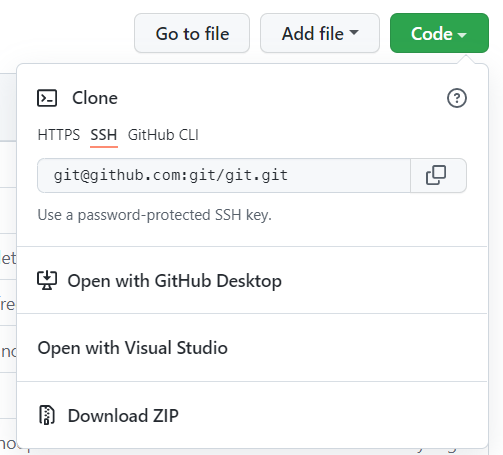

:::note

本来这只是一个普通的记录 blog 和技术分享，用来记录我自己尝试着搭建了一个 Git 服务端的过程，恰好碰到了近两天国内知名 Git 仓库服务网站 Gitee 被要求进行代码整改这一让人啼笑皆非的新闻，一下子就被打上了「有先见之明」这种标签，并且把这篇 blog 拉到了不属于它的高度。总之无论如何，这篇 blog 的本意很简单，整个尝试过程也略显曲折，中间的各种技术方案也欢迎大家讨论。

:::

## 背景

搭建 git server 是为了一个当时正在做的实验室项目 Open Project，简单来说这就是一个自建在学校内部的、贴合学校实际业务定制的 GitHub。关于为什么不用现成的 GitHub 而选择自己搭一个这个问题就不赘述了，具体在开发文档中应该有详细说明。

既然要自己搭一个 GitHub，就得有 GitHub 的那些功能。当时已经做了用户和项目系统的后端和数据库，传统 web API 的接口都已经写得差不多了，不过项目本身还是个「空壳」，除了能起个标题打个 tag 之外，整个主体部分就只有一个 description 字段。开发到这里下一步的需求就是能让项目能储存代码和文档，并且能让用户通过现有的工具与其交互。提取一下需求，大概就是以下几点：

- 每个项目对应一个 git 仓库（git repository），能够通过 git 进行版本控制
- 用户能用已有的 git 客户端（例如 git bash，以及各种 GUI 工具）与线上的代码仓库进行交互，包括常见的 clone、push、fetch 等操作，也包括一些进阶操作（例如分支管理、远端有更新时会 reject 不带 --force 的 push 等）
- 服务端需要带有鉴权系统，用户对 git 仓库的读写权限受到现有的用户和项目系统控制。用户是否能够 clone、push 这些操作的取决于 project visibility、participant role 等条件（这部分已经完成开发，有 HTTP API 可以对接）

这些需求对当时的我来说还是很有难度的，我当时只会用框架写写前后端，应付一下常见的 HTTP 请求流程，对 git 的了解也仅限于上面列的这些日常用得到的命令。

## SSH approach

:::caution

提前说明，目前为止据我的了解 ssh 这种方法确实能够很好地满足我第一、第二点需求，但是对于鉴权系统来说 ssh 只能采用服务器 ssh 连接那种一刀切的方式，要么连上之后具有对所有仓库的读写权限，要么就是完全连不上。如果你跟我一样「选择性授权」是必须的需求，并且关心的是如何实现一个自己的服务端，那可以直接跳过这部分去看 HTTP 协议部分。如果你知道能够选择性授权的 ssh 协议配置方法，或者了解有关 ssh 协议鉴权的具体细节，非常欢迎来一起讨论。

:::

git 自带 http、ssh，以及一种 git 自创通讯协议。这其中 ssh 是我最开始尝试的一种。如果 url 的格式是 `git@[hostname]:[path].git` 这种类型，就说明 git 使用的是 ssh 协议。其实 url 中 `@` 符号前的 `git` 就是 username，而 `.git` 就是 path 的一部分；这样看来这其实跟 `ssh [username]@[host]:[path]` 的格式一模一样。

:::note

本文中经常使用 [中括号] 代指需要替换的内容，例如 host 指代的是服务器的 IP 地址或域名，例如 140.82.114.4 或 github.com ；而 path 指一段服务器上的路径，例如 Criheacy/MyBlog 。

:::

GitHub 就支持 http 和 ssh 这两种协议：



根据上面的分析，我们要首先创建一个叫 git 的用户，并且允许 ssh 连接到它：

```shell
# on server

sudo useradd git
# become the "git" user
su git
# navigate to /home/git
cd
mkdir .ssh
chmod 750 .ssh  # 700 if no need for user group
cd .ssh
# create store for pub keys
touch authorized_keys
chmod 640 authorized_keys # 600 if no need for user group
```

为了验证用户的身份，ssh 需要使用公钥/私钥认证。之前生成的密钥对，在 Windows 系统中储存在 `C:\Users\[username]\.ssh` ，在 Linux 系统中则储存在 `~/.ssh` 。如果之前生成过密钥，那可以跳过生成密钥的过程，只需要把密钥添加到服务器上就可以；如果没有，则需要进行以下步骤：

- 使用 ssh-keygen 命令生成密钥对：

  ```shell
  ssh-keygen -t ed25519 -C "[email_address]"
  ```

  这里也可以生成 rsa 密钥：

  ```shell
  ssh-keygen -t rsa -b 4096 -C "[email_address]"
  ```

  我查到的一些资料说 ed25519 性能和安全性会优于 rsa 算法，但是通用性不如 rsa ，一些低版本的 ssh 只支持 rsa 。

  - 这里 -C 可以指定密钥说明信息，不写的话会默认填上路径+用户名的信息（GitHub 上要求填写邮箱地址，没尝试过不填会怎么样）

- 根据提示完成密钥生成过程：

  - 指定密钥储存位置：默认路径即可；如果不是默认路径则需要连接时手动指定
  - 指定签名（passphrase）：填不填都行，如果填写则需要在连接时提供

生成完成之后，将生成的 `.pub` 文件内容复制到服务器上刚才创建的 `authorized_keys` 文件中。可以物理复制（拿张纸条抄过去），如果是本机 ssh 连的服务器也可以 `Ctrl+C` 然后在服务器上 `echo "[Ctrl+V]" >> authorized_keys` 。总之执行 `cat authorized_keys` 之后应该能看到类似下面的内容（若 rsa 生成的则前缀是 ssh-rsa）：

```text
ssh-ed25519 AAAAxxxxxxxx...xxxxxxxx [email_address]
```

现在客户端已经可以通过 ssh 连接到服务器上的 git 用户了。接下来在服务器上创建 git 的目标仓库：

```shell
# on server, as user 'git'

cd
mkdir [repository_name].git
cd [repository_name].git
# create bare repository
git init --bare
```

`repository_name` 可以任意指定的目录名称，也可以像 GitHub 一样是一段路径（`owner_name/repository_name`），总之能访问到对应的文件夹即可。这个文件夹地址如果不以 `/` 开头，则指代的是 git 的用户根目录（`/home/git/[repository_name]`）。

:::info

这一步应用在系统中时可以由程序自动完成，即创建项目的 API 收到请求后 RPC 调用管理 git 相关服务的服务端，由这个服务端执行一系列上述脚本命令来创建项目文件夹并创建 git 裸仓库。

:::

如果一切就绪，这时候就能像 push 到 GitHub 一样 push 到这个服务器上的仓库了：

```shell
# on developer's PC

mkdir [repository_name]
# do some changes
git add .
git commit -m "Initial commit"
git remote add origin git@[hostname]:[repository_name].git
git push origin main
```

如果在生成密钥时没有储存在默认路径，而是存储在自定义的位置，就需要为 git 额外添加一条 ssh 配置：

```shell
git config --add --local core.sshCommand 'ssh -i [ssh_key_path]'
```

而如果是同一个仓库下不同远端仓库使用的 ssh 密钥的储存位置不同（其实建议同一个本地密钥上传到多个远端最方便，当然安全性肯定是分开更高），可以参考[这个回答](https://stackoverflow.com/a/7927828)。

同样的，在别的授权过的电脑上也可以把仓库下载下来：

```shell
# on developer's PC
git clone git@[hostname]:[repository_name].git
```

到此为止，git 服务端已经能够实现最基本的用户授权以及常规的 git push 和 git pull 等操作了。不过还有个小问题，因为 git 是使用 ssh 进行访问的，上面也能看出来 git 的连接 url 跟 ssh 连接时的 url 很像，所以假如你尝试用 ssh 连接服务器：

```shell
ssh git@[host_name]
```

你会发现这也是可行的。当然我肯定不希望用户能通过 git 以外的方式直接操作服务器上的文件或者做一些其它的危险操作，而 git 也给出了自带的解决方案，即 git-shell 。这是一种定制后的 shell 程序，它能够限制授权的用户在 ssh 连接后只进行 git 相关的操作（也可以自定义放行一些其它的操作）。

git-shell 会随着 git 自动安装，但不一定会出现在系统默认 shell 列表中。所以在使用它之前需要先检查：

```shell
# check system default shell list
cat /etc/shells
# if git-shell is not in the list:
# check if git shell has already installed
which git-shell
# if installed, add its path to the list
which git-shell >> /etc/shells
```

添加完成后，使用 `chsh` 命令来切换用户的 shell：

```shell
sudo chsh git -s [path_of_git-shell]
```

这之后如果再尝试通过 ssh 连接到 git 用户，服务器会提示授权成功，但是拒绝这个连接：

```text
fatal: Interactive git shell is not enabled.
hint: ~/git-shell-commands should exist and have read and execute access.
```

为了更全面地防止用户通过 ssh 端口转发来间接访问 git 服务器，可以编辑刚才的 `.ssh/authorized_keys` 文件来禁止通过端口转发的方式访问。在要进行限制的授权公钥前面加上：

```text
no-port-forwarding,no-X11-forwarding,no-agent-forwarding,no-pty
```

现在 `cat authorized_keys` 之后应该能看到类似下面的内容：

```text
no-port-forwarding,no-X11-forwarding,no-agent-forwarding,no-pty ssh-ed25519 AAAAxxxxxxxx...xxxxxxxx [email_address]
```

现在用户已经无法通过 ssh 的方式连接到 git 用户了，只能使用规定的 git 命令（例如 git push 、 git pull 等）。

到此为止，这基本就是 git 自带的 ssh 连接方式能够实现的全部功能了。然而这显然还是不够的，我需要 git server 能与现有的网站认证方式进行交互，由存在数据库里的 project participant 表来决定用户对仓库的访问权，而不仅仅是通过 ssh 认证的公钥来「一刀切」地决定访问权限。我判断大致的实现方式是新搭一个后端来接受 git 的网络请求，然后通过 RPC 的方式来调用现有的授权服务接口，不过如何处理 git 网络请求仍是一个难点。

## HTTP approach

:::info

摸索的过程是很辛苦的。了解一个全新的领域需要翻阅大量的文档和代码，中间走了不少弯路也掉过不少坑，而这些不需要也不可能全部记录下来。这里就站在山顶上总结一下整个上山的过程；如果你想了解更多的细节，我也把这个过程中参考的文档和网站放在了文档末尾。

:::

### [git-http-backend](https://github.com/git/git/blob/master/http-backend.c)

正如其名，这是一个官方实现的基于 HTTP 协议的 git 服务端，可以 serve 起一个仓库供客户端与其交互。在安装 git 时这个应用程序也会随之安装到运行库中（在 Windows 下在 `git\mingw64\libexec\git-core\git-http-backend.exe`，Ubuntu 下在 `/usr/lib/git-core/git-http-backend`，可能会因为发行版本有所差异）。

这个程序是一个 CGI 脚本（Common Gateway Interface）。其实据我后来查资料了解 CGI 脚本其实已经是被时代淘汰的产物了，现在的网络服务大多数都用 Spring、Express、Django 等这些现成的框架实现，可能是当年 git 刚被创造出来的那个年代这些框架还都不成熟，加之 git 本身就是用 C 语言写的，它附带的 http 框架于是也就是使用 C 语言实现的 CGI 脚本程序了。

这个 CGI 脚本依赖一套复杂（至少我认为很复杂）的 Apache 服务来启动，它本身并不处理网络请求相关的接口，只负责实现逻辑，通过外部的环境将 web 请求参数通过类似设置环境变量一样的方式传入脚本，再由 CGI 脚本负责后续逻辑的执行。我只了解这些原理，**并没有真的去部署这个脚本**，看到那一堆 Apache 配置文件就被劝退了。这个脚本好像是可以对接授权系统的，然而授权逻辑肯定是写在 Apache 配置文件中的，我推测相当于把这个外层运行的 Apache 服务作为一个鉴权网关，而这只会让那个配置文件更难写。

我仔细看了一遍 git-http-backend 源代码的逻辑处理部分，发现其实也并不是很难，很多服务都相当于一个 Nginx 静态资源代理，它真正难以阅读和理解的原因主要是它是用 C 语言写的；同时我也发现了一些[用别的语言实现的 git 服务端](https://github.com/asim/git-http-backend)。思来想去，我决定用新的框架自己写一个 git 服务端。

### 实现原理

Git 的 HTTP 传输协议分为 dumb 协议和 smart 协议两种（官方译名叫「哑协议」和「智能协议」，本文中使用英文原名）。Smart 协议自 git-v1.6.6（2009 年 11 月发布）引入，时至今日绝大多数的 Git 客户端都早已经支持两种协议类型；并且由于 dumb 协议的种种特性已经逐渐被各大 git hosts 弃用，包括 GitHub、Bitbucket 等。

### Dumb 协议

Dumb 协议基本等同于一个静态资源网关服务器，类似 Nginx 的静态资源代理功能。想要搭建一个 dumb 服务器，只需要设置对以下路径的代理：

- `/HEAD`
- `/info/refs`
- `/objects/info/alternates`
- `/objects/info/http-alternates`
- `/objects/info/packs`
- `/objects/[0-9a-f]{2}/[0-9a-f]{38}`
- `/objects/[0-9a-f]{2}/[0-9a-f]{62}`
- `/objects/pack/pack-[0-9a-f]{40}\.pack`
- `/objects/pack/pack-[0-9a-f]{64}\.pack`
- `/objects/pack/pack-[0-9a-f]{40}\.idx`
- `/objects/pack/pack-[0-9a-f]{64}\.idx`

这些路径都是相对 git 仓库下的 `.git` 文件夹而言的，你可以打开任意一个（有提交记录的）git 仓库，就可以查看到 `.git` 文件夹下的这些文件。其中 `/info/refs` 需要你在仓库中手动执行 `git update-server-info` 命令，而 pack 相关的文件是 git 减小文件大小而生成的压缩包，可以执行 `git gc` 命令手动要求 git 打包，也可以等待提交数量足够多时 git 可以自动完成打包。

在设置好上述代理后，只需要按照请求依次返回结果即可，找到的文件返回 200 OK，找不到的就返回 404 Not Found，客户端启动 fetch 进程之后会自动检查需要的文件，然后按照需要发送请求。

但这种方式只能从服务端下载到客户端，无法通过 git push 等命令上传文件；同时每次传输都需要将整个仓库中的文件依次传输（有的客户端会有优化），传输效率比较低。 从安全角度考虑，这会将服务端的文件目录结构暴露给用户；而且实际上 `.git` 目录并不是最高效的存储方式，如果服务端想要对这种结构优化就很难适配 dumb 协议（[GitHub 就因为优化存储结构的问题取消了对 dumb 协议的支持](https://github.blog/2011-03-09-git-dumb-http-transport-to-be-turned-off-in-90-days/)）。

### Smart 协议

Smart 协议就比 dumb 协议智能很多，总的来说它会先判断对方有没有这个文件，然后只传输对方没有或被更新的文件。而且如果只搭建一个服务端，这些功能并不需要我们自己实现，git 已经提供了四个命令来供我们的服务端 RPC 调用。

在从客户端上传到服务端的过程中，客户端启动 `send-pack` 进程，服务端启用 `receive-pack` 进程；从服务端下载到客户端的过程中，客户端启用 `fetch-pack` 进程，而服务端启用 `upload-pack` 进程。你可以在任意一个 git 目录尝试输入这些 git 命令（例如输入 `git send-pack`，在服务端使用 RPC 调用时则需要附带 `--stateless-rpc` 参数）；同样的你也可以向任意一个服务端发送请求来调起它们对应的传输进程（例如访问 `GET https://github.com/{user}/{repository}/info/refs?service=git-upload-pack` ，可以看到 `upload-pack` 这个进程发回的包）。

因为已经有这部分的实现只需要 RPC 调用，所以就不展开介绍这四个进程内部的原理了（实际上是我看到有现成的就没怎么仔细看源码，这部分原理我也不是很清楚）；不过如果后面需要像 GitHub 一样优化存储结构可能就需要自己手写这些具体的业务细节。

:::caution

需要注意的是，这些进程之间传输的数据是字节流（byte stream），并不能被哪一种编码方式解码成能读懂的字符串，也不能转换为字符串之后再进行进程之间的传输（在 java 中需要直接对 InputStream 和 OutputStream 进行操作）。

同时，HTTP 的流只能读取一次，我曾经想把 RPC 服务的输入输出流读取出来看看内容，结果因此 flush 掉了缓冲区，在真正读取处理的时候读不到东西。因为上述原因 debug 了好久，特此把踩过的坑列出来。

:::

这就是 git 使用 HTTP 协议的实现原理，到此其实已经足够自己实现一个 git-http-server 了。这个过程只需要设置一些静态代理，如果不需要保持对 dumb 协议的兼容，那就只需要 RPC 调用一些 git 自带的处理方法，填填参数做做转发，甚至比上面配置 ssh 的过程还简单。

:::note

现在 Open Project 中的 Git Server 还没有完全完工，等那边完成后（如果开源的话）我会整理一下代码把连接放在这。

:::

### 接入鉴权系统

> To be continued ...


## Reference

- [「官方」git-http-backend 源代码](https://github.com/git/git/blob/master/http-backend.c)
- [Go 语言实现的 git-http-server](https://github.com/asim/git-http-backend)
- [「官方」（没写完的）git smart-http 协议内部原理](https://github.com/git/htmldocs/blob/de44de3d9e71db785a0bbd06a6ddad8d2c38dd67/technical/http-protocol.txt#L513)
- [「官方」git 中的 pack 文件传输协议](https://github.com/git/git/blob/master/Documentation/technical/pack-protocol.txt)
- [Git 内部原理 - 传输协议](https://git-scm.com/book/zh/v2/Git-%E5%86%85%E9%83%A8%E5%8E%9F%E7%90%86-%E4%BC%A0%E8%BE%93%E5%8D%8F%E8%AE%AE)

